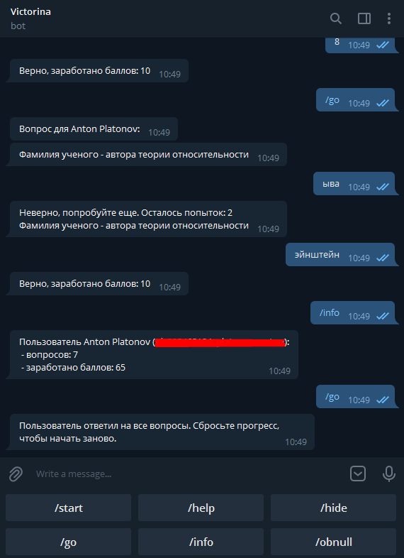

## Телеграм-бот "Викторина"

Платонов Антон  
Бот для проведения викторин http://t.me/MasterOfVictorinaBot.  

Используется библиотека PyTelegramBotAPI, при старте бота при отсутствии в директории db 
создается БД Sqlite3 и заполняется таблица вопросов из файла /dbhelper/question_data.sql.   
Вопросы из таблицы выбираются случайный образом, при исчерпании вопросов предлагается сбросить прогресс. 
Очки начисляются в зависимости от количества использованных попыток. 
Сравнение с правильным ответом точное без учета регистра. 

### Требования
Должны быть установлены:
- git
- python (>=3.9)
- pipenv

### Установка и запуск
1. Создаем бота в Telegram  
   1.1. Находим в поиске @BotFather, стучимся к нему  
   1.2. Создаем и настраиваем бота (команда /help и/или можно почитать https://core.telegram.org/bots)  
   1.3. Сохраняем "token to access the HTTP API", в дальнейшем этот токен надо будет поместить в конфиг  
2. git clone https://github.com/aplatonov/python-victorina-bot.git
3. cd python-victorina-bot
4. pipenv sync (создание виртуального окружения)
5. pipenv shell (активация виртуального окружения)
6. cp config.example config.py
7. Вносим актуальные значения в config.py
8. Запускаем бота python main.py

### Доступные команды
- /start - описание и помощь 
- /help - описание и помощь
- /go - получить вопрос и ответить на него
- /info - статистика ответов пользователя
- /obnull - сброс прогресса пользователя

### ТОDO (запланировано, но пока не реализовано)
- командой /go выдавать не один вопрос, а несколько
- ограничить ответ на вопрос временем, задаваемым в конфиге
- ~~изобразить кнопочное меню~~
- ~~подбирать вопросы из числа тех, которые не были заданы пользователю~~
- ~~добавить команду сброса прогресса пользователя (/obnull)~~